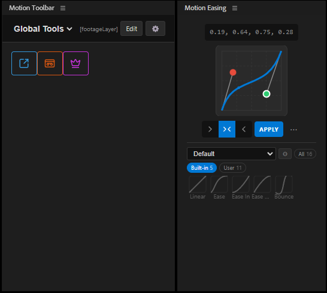

# Motion Toolbar for After Effects

**Thank you for supporting Motion Toolbar!** 💛

Motion Toolbar is a suite of panels for Adobe After Effects that speeds up the
everyday work of motion designers — custom macro buttons, a math-accurate
easing editor, a color-palette workbench, a one-click GIF exporter, an
Illustrator/Photoshop → After Effects artwork bridge, and a searchable command
palette. This guide is written for artists, not coders: you do **not** need to
know anything about programming to install or use it.



---

## 📦 What's in the box

Motion Toolbar bundles **five panels**, all reachable from
**Window → Extensions** inside After Effects:

| Panel            | What it's for                                                              |
| ---------------- | -------------------------------------------------------------------------- |
| **MTAG Toolbar** | Your custom macro buttons — build your own toolbar of shortcuts.           |
| **MTAG Easing**  | A precision cubic-bezier easing editor with Flow-compatible libraries.     |
| **MTAG Color**   | A color-wheel + palette workbench with project sync and export.            |
| **MTAG GIFS**    | Export your active comp straight to an optimized GIF, no round-tripping.   |
| **MTAG Switch**  | Send vectors, text, and images from Illustrator & Photoshop into AE.       |

Inside MTAG Toolbar you also get the **Command Palette** — press
**Ctrl/Cmd + K** to fuzzy-search every AE menu command and your own macros.
And a **Secondary Toolbar** panel gives you a second copy of the macro
dashboard, so you can keep two profiles docked at the same time.

---

## ✅ Before you start

- **After Effects CC 2022** or newer (any newer version works too).
- **Windows 10/11** or **macOS 10.15 (Catalina)** or newer.
- About **200 MB** of free disk space.

That's it. No Node.js, no terminal, no build steps.

---

## 💻 Installation

You have two ways to install. **Method A (ZXP)** is the easiest and what
most buyers should use. **Method B (manual)** is a fallback if the ZXP
installer refuses to run.

### Method A — Install the .zxp (recommended)

1. Download and install a free ZXP installer. Any of these work:
   - **[ZXP/UXP Installer by Adobe Exchange](https://exchange.adobe.com/apps/cc/107650/zxp-uxp-installer)** (official, free)
   - **[Anastasiy's Extension Manager](https://install.anastasiy.com/)** (free)
   - **[ZXPInstaller](https://zxpinstaller.com/)** (free, open source)
2. Fully quit After Effects.
3. Open your installer and drag `MotionToolbar.zxp` onto its window
   (or use its "Install" button and pick the file).
4. Open After Effects → **Window → Extensions** and pick any of the
   MTAG panels.

That's it. Skip to **First launch** below.

### Method B — Manual install

Use this only if the ZXP installer doesn't work on your system.

1. **Unzip** the `MotionToolbar` folder from your download.
2. **Enable "PlayerDebugMode"** — this is a one-time system setting that lets
   After Effects load extensions that aren't signed by Adobe:
   - **Windows** — press `Win + R`, type `regedit`, press Enter, then navigate to
     `HKEY_CURRENT_USER\Software\Adobe\CSXS.11` (or the highest `CSXS.*`
     number you have). Right-click → **New → String Value**, name it
     `PlayerDebugMode`, and set its value to `1`.
   - **macOS** — open **Terminal** and paste this in, then press Enter:
     ```
     defaults write com.adobe.CSXS.11 PlayerDebugMode 1
     ```
     (If AE still doesn't see the panel, try `CSXS.10` and `CSXS.12` too.)
3. **Copy the `MotionToolbar` folder** into your Adobe CEP extensions folder:
   - **Windows**: `C:\Users\<your name>\AppData\Roaming\Adobe\CEP\extensions\`
   - **macOS**: `~/Library/Application Support/Adobe/CEP/extensions/`

   (If the `extensions` folder doesn't exist, create it.)
4. Restart After Effects → **Window → Extensions → MTAG Toolbar** (or any of
   the other MTAG panels).

---

## 🚀 First launch

After installation, open **Window → Extensions** in After Effects and you'll
see all five panels. You can dock them wherever you like — I recommend
docking **MTAG Toolbar** and **MTAG Easing** side-by-side on the right, and
keeping **MTAG Color** and **MTAG GIFS** as floating panels you open on
demand.

**Tip:** Right-click any empty tile on the Toolbar to create your first
macro. There's no wrong way to start — everything is editable.

---

## 🎛 The five panels in detail

### 1. MTAG Toolbar — your custom macro dashboard

Build a personal toolbar of one-click buttons that adapts to what's selected
in AE.

- **Multi-action buttons** — bind menu commands, expressions, JSX scripts,
  or `.ffx` presets to a single button.
- **Macro sequences** — chain steps in order (e.g. *Add Null →
  Rename → Parent selected layers to it*).
- **Automatic profiles** — build separate toolbars for Shape Layers, Text,
  Cameras, Nulls, etc. The UI switches profiles instantly when your
  selection changes.
- **Hotkeys** — bind any macro to a keyboard shortcut.

**How to use it**

- **Right-click** any empty tile to add a new macro.
- Click the **✏️ Pencil** icon to enter Edit Mode — drag tiles to rearrange
  them, or click one to edit its actions.
- Click the **⚙ Gear** icon to open the settings panel (theme, tile size,
  profile management, import/export).

### 2. MTAG Easing — the easing editor

A high-precision cubic-bezier editor built for real motion work.

- **Math-accurate** — uses the same Euclidean-distance logic as pro tools
  like Flow, so eases feel *right* on 2D and 3D spatial properties.
- **Native keyframes** — writes real AE temporal easing (not expressions),
  so your timeline stays fast and portable.
- **Flow-compatible** — imports and exports `.flow` library files. Your
  existing library keeps working.
- **Smart read** — select two keyframes to read a segment's curve, or one
  keyframe to read the eases on either side of it.
- **Spatial + color aware** — correctly handles Position, Scale, Rotation,
  and Color properties, accounting for AE's internal coordinate systems and
  0–255 color scaling.

**How to use it**

- **Apply an ease** — drag the bezier handles, then click **APPLY**. Choose
  *In*, *Out*, or *Both* to control which side of the keyframes gets the
  curve.
- **Read an existing ease** — select one or two keyframes and click **Read**
  in the overflow menu to pull the curve into the editor.
- **Numeric entry** — click the numeric strip at the top of the editor to
  type bezier coordinates directly.
- **Manage your library** — use **Import** in the overflow menu to load a
  `.flow` file, or **Export** to share yours.

### 3. MTAG Color — palette workbench

Work in a familiar color wheel, save palettes, and sync them straight into
your AE project.

- **Wheel + palette tabs** — pick colors from harmonies (complementary,
  triadic, analogous…) or manage a working palette.
- **Project sync** — push your palette into the active AE project as a
  reusable set of solids/expressions with one click.
- **Import/export** — supports `.ase` (Adobe Swatch Exchange) and common
  palette formats, so you can share palettes with Illustrator, Photoshop,
  and other tools.
- **Auto-restore** — your working palette is remembered between sessions.

### 4. MTAG GIFS — one-click GIF export

Render the active comp straight to an optimized GIF without going through
Media Encoder.

- **Native export** — renders through a bundled AE output-module template.
- **High-quality encoder** — uses **gifski** and **ffmpeg** under the hood
  for crisp results at small file sizes.
- **Settings panel** — output folder, size, FPS, quality, loop behavior,
  "open folder when done" and "play after export" all live in a floating
  settings window.
- **Convert existing files** — you can also drop a video file to convert
  it to a GIF without touching AE's render queue.

**Note:** the GIF panel needs `ffmpeg` and `gifski` binaries in the
`bin/win/` or `bin/mac/` folder of the extension. If you bought the packaged
`.zxp`, these are already included. If you installed manually and the panel
says "binaries not found", see **Troubleshooting** below.

### 5. MTAG Switch — Illustrator & Photoshop → After Effects

Send artwork straight from **Illustrator** or **Photoshop** into After Effects —
no copy-paste, no re-drawing, no exporting files by hand.

- **Live, editable results** — vector paths come in as real AE shape layers.
  Rectangles, ellipses, and stars stay **parametric** (editable Rect/Ellipse/
  Polystar), not frozen bezier paths.
- **Full appearance** — strokes (width, caps, joins, dashes), linear/radial
  gradients, opacity, blend modes, compound paths, and clipping masks come
  across with your art.
- **Real text** — type layers arrive as **editable AE text** with the right
  font, size, color, and multi-style runs preserved (point and area text).
- **Images too** — placed/embedded artwork in Illustrator, and selected
  Photoshop layers, import as footage and land in the right spot automatically.
- **No second panel to babysit** — transfers ride Adobe's own app-to-app
  bridge, so After Effects receives even if its Switch panel is closed.

**How to use it**

- In **Illustrator** or **Photoshop**, select the artwork you want to send.
- Open the **MTAG Switch** panel (Window → Extensions) and click **Send**.
- Switch to After Effects — your art is already there, on the active comp.
- Use the toolbar toggles to choose grouped vs. separate layers, anchor
  behavior, and whether recognised shapes come in as live shapes or raw paths.

**Note:** MTAG Switch also appears in Illustrator and Photoshop under
**Window → Extensions** (that's how it sends). It works on the same machine —
After Effects, Illustrator, and Photoshop just need to be running.

#### Bonus: the Command Palette — Ctrl/Cmd + K

Built into MTAG Toolbar (not a separate panel): press **Ctrl + K** (Windows)
or **Cmd + K** (macOS) inside any Motion Toolbar panel to open a
fuzzy-searchable list of every AE menu command *and* every macro you've
built. Type a few letters, hit Enter — done.

---

## 🧯 Troubleshooting

**"I don't see the panel under Window → Extensions."**
Restart After Effects fully. If you installed manually, double-check the
`PlayerDebugMode` step — that's the #1 cause of missing panels. On some
systems the correct registry key is `CSXS.10` or `CSXS.12` instead of
`CSXS.11` — try setting `PlayerDebugMode` in all of them.

**"The panel is blank / just white."**
Right-click the panel and pick **Reload Extension**, or close and reopen it.
If that doesn't help, restart AE.

**"GIF export says 'binaries not found'."**
The GIF panel needs `ffmpeg` and `gifski` in the extension's `bin/` folder.
The `.zxp` download includes them. If you installed manually and they're
missing, download static builds from
[ffmpeg.org](https://ffmpeg.org/download.html) and
[gif.ski](https://gif.ski), then drop the executables into:

- **Windows:** `bin/win/ffmpeg.exe` and `bin/win/gifski.exe`
- **macOS:** `bin/mac/ffmpeg` and `bin/mac/gifski`
  (on macOS, open Terminal in the `bin/mac/` folder and run
  `chmod +x ffmpeg gifski` so the system will run them)

**"macOS says the extension is from an unidentified developer / can't be
opened."**
Open **System Settings → Privacy & Security** and click **Open Anyway**
next to the blocked file. This only needs to happen once per binary.

**"My hotkeys stopped working."**
Hotkeys are only listened to while a Motion Toolbar panel has focus. Click
once inside the panel to give it focus, then the shortcuts fire.

**"I lost my macros / palettes after updating."**
Your settings are stored per-panel in AE's preferences. Use the **Export**
button in each panel's settings before updating so you can restore if
anything drifts.

---

## ❓ FAQ

**Do I need to buy anything else to use this?**
No. Everything you need is in the download. You just need After Effects
itself.

**Does this work on both Windows and macOS?**
Yes. The same download covers both platforms.

**Does it work with Apple Silicon (M1/M2/M3/M4)?**
Yes — as long as your After Effects is up to date, Motion Toolbar runs
natively.

**Will this work on After Effects 2025 / 2026?**
Yes, on today's release. Adobe is moving from CEP to UXP over the coming
years; a UXP version is on the roadmap and will ship as a free update.

**Can I use my existing Flow easing library?**
Yes — the Easing panel imports `.flow` files directly.

**Can I share my toolbar / macros with a friend?**
Yes. Open the Toolbar settings → **Export** to save your setup as a file,
and your friend can **Import** it in their copy.

**I paid $0 / a small amount. Am I allowed to use it commercially?**
Yes. Whatever you paid, you're licensed to use Motion Toolbar in your
personal and commercial work. See `LICENSE`.

**Can I redistribute it?**
Please don't. Point people at the Gumroad page so they can name their own
price too — it's the only way this project can keep getting updates.

---

## 💛 Supporting the project

Motion Toolbar is **"name your own price"** on Gumroad. If it saves you
time and you'd like to see it keep growing, bumping your contribution up
from $0 is the single biggest thing you can do to support development.

If you want to give feedback, report a bug, or request a feature — send me
a message through the Gumroad product page. I read every one.

---

## 📜 What's on the roadmap

- [x] Math-accurate spatial easing
- [x] Flow library import
- [x] Color palette workbench with project sync
- [x] Native GIF export
- [ ] UXP migration (future-proofing for After Effects 2025+)
- [ ] Multi-profile cloud sync
- [ ] Community macro marketplace

---

## 📄 License & credits

Motion Toolbar itself is distributed under the license in `LICENSE`.

The GIF panel ships with third-party binaries:
- **ffmpeg** — LGPL/GPL. License text included in the download.
- **gifski** — AGPL-3.0. Source is available on request.

Built with ❤️ for the motion community.
